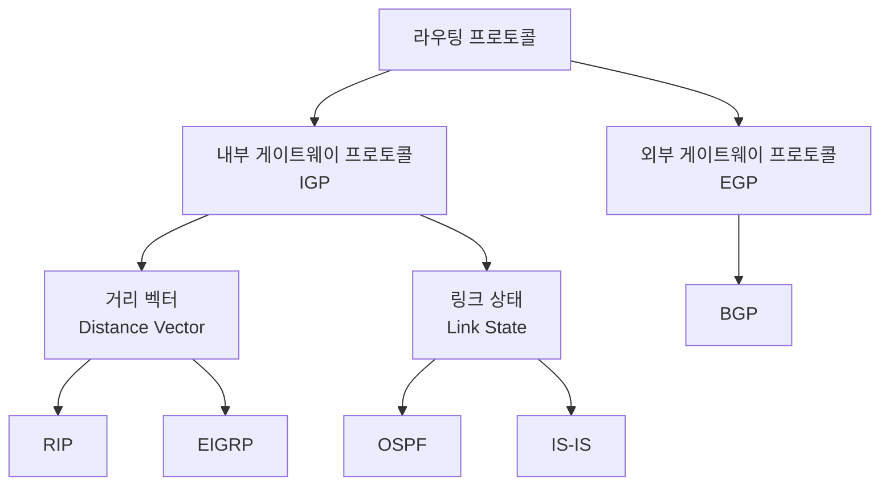
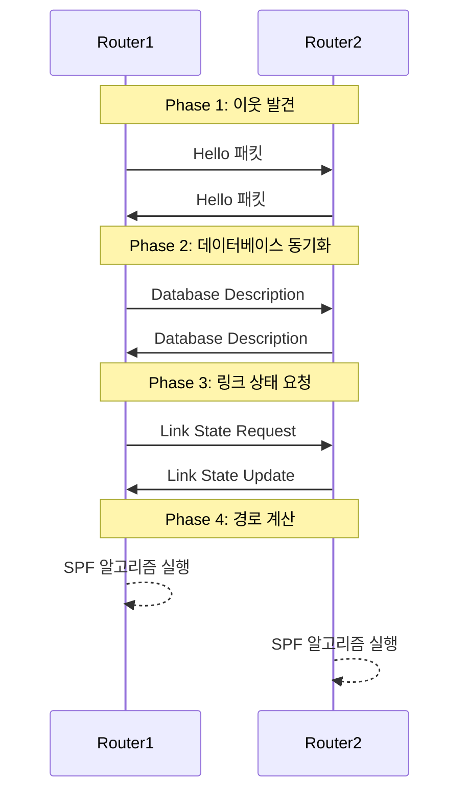
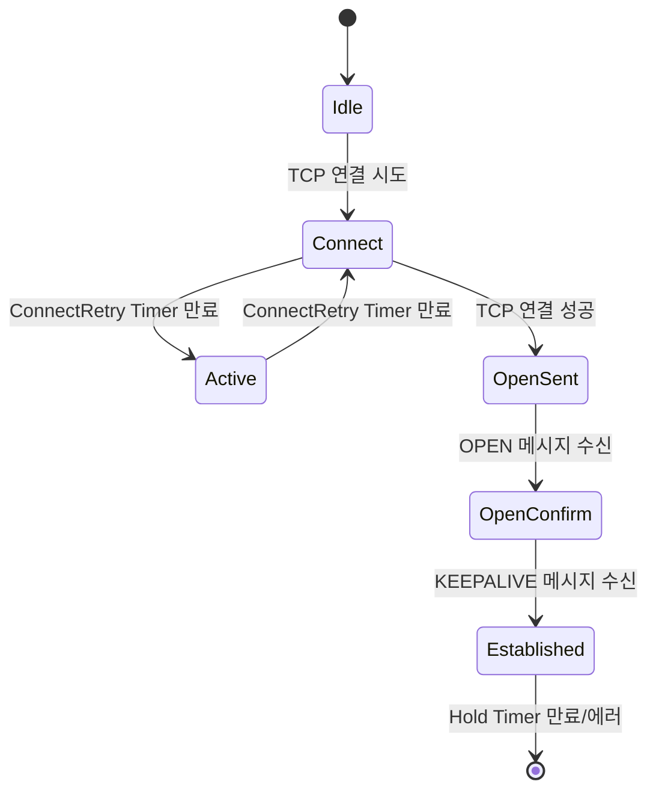

### 네트워크 계층의 역할
- IP 주소를 이용해 송수신지 대상을 지정, 다른 네트워크에 이르는 경로를 결정하는 라우팅을 통해 다른 네트워크와 통신

### 데이터 링크 계층의 한계
- MAC 주소 기반 통신
- MAC 주소만으로는 모든 네트워크에 속한 호스트 위치 특정하기 어려움
	- NIC에서 할당된 고정 주소.
- 수신인과 수신지가 필요함. (MAC주소는 수신인, IP주소는 수신지)

### IP (Internet Protocol)
#### IPv4
- 32비트 주소 체계
- 8비트씩 4부분으로 구성 (예: 192.168.0.1)
- ![[Pasted image 20241202235616.png]]
#### IPv6
- 128비트 주소 체계
- 16비트씩 8부분으로 구성
- 헤더 단순화
- 보안 기능 강화
- QoS 지원 개선
- ![[Pasted image 20241202235853.png]]

### ARP (Address Resolution Protocol)
- IP 주소→MAC 주소 변환
- ARP 캐시 테이블 유지
- 브로드캐스트 사용

## IP 주소 체계

### 클래스풀 (Classful)
```
Class A: 0.0.0.0 ~ 127.255.255.255
Class B: 128.0.0.0 ~ 191.255.255.255
Class C: 192.0.0.0 ~ 223.255.255.255
Class D: 224.0.0.0 ~ 239.255.255.255
Class E: 240.0.0.0 ~ 255.255.255.255
```

### 클래스리스 (Classless)
#### CIDR (Classless Inter-Domain Routing)
- 서브넷 마스크 사용
- 표기법: IP주소/비트수 (예: 192.168.0.0/24)
- 유연한 네트워크 분할

### IP 주소 종류
#### 공인 IP vs 사설 IP
- 공인 IP: 인터넷에서 사용
- 사설 IP: 내부 네트워크용
	- Class A: 10.0.0.0/8
	- Class B: 172.16.0.0/12
	- Class C: 192.168.0.0/16

#### NAT (Network Address Translation)
- 사설 IP ↔ 공인 IP 변환
- 주소 절약
- 내부 네트워크 보호

#### IP 할당 방식
- 정적 할당: 수동 설정
- 동적 할당: DHCP 사용
	- DORA 프로세스
		1. Discover
		2. Offer
		3. Request
		4. Acknowledge

## 라우팅

### 라우터
- 네트워크 계층 장비
- 서로 다른 네트워크 연결
- 최적 경로 결정

### 라우팅 테이블
- 목적지 네트워크 정보
- 넥스트 홉 정보
- 메트릭 값

### 라우팅 방식
#### 정적 라우팅
- 수동 경로 설정
- 관리자 설정 필요
- 작은 네트워크에 적합

#### 동적 라우팅
- 자동 경로 설정
- 라우팅 프로토콜 사용
- 큰 네트워크에 적합

### 라우팅 프로토콜
#### IGP (Interior Gateway Protocol)
- RIP
	- 거리 벡터 방식
	- 홉 카운트 기준
	- 최대 15홉
- OSPF
	- 링크 상태 방식
	- 다익스트라 알고리즘
	- 영역 기반 구성

#### EGP (Exterior Gateway Protocol)
- BGP
	- 경로 벡터 방식
	- AS간 라우팅
	- 정책 기반 라우팅


# 라우팅 프로토콜 상세 분석

## 1. 라우팅 프로토콜 분류



## 2. OSPF (Open Shortest Path First)

### 2.1 기본 특징
- 링크 정보 및 현재 네트워크 상태를 그래프의 형태로 링크 상태 데이터베이스에 저장.
- 링크 상태 프로토콜
- Dijkstra의 SPF 알고리즘 사용
- 빠른 수렴 시간
- 대규모 네트워크 지원
- 네트워크 구성 변경시 라우팅 테이블 갱신 

### 2.2 OSPF 동작 과정



### 2.3 OSPF 영역 타입
1. **백본 영역 (Area 0)**
   - 모든 다른 영역과 연결
   - 라우팅 정보의 중심점

2. **일반 영역**
   - 표준 영역
   - 모든 LSA 타입 허용

3. **스텁 영역**
   - 외부 경로 차단
   - LSA Type 5 차단 

4. **완전 스텁 영역**
   - 외부 및 요약 경로 차단
   - 기본 경로만 허용

5. **NSSA**
   - 제한적 외부 경로 허용
   - LSA Type 7 사용


|영역 타입|내부 경로|영역 간 경로|외부 경로|기본 경로|
|---|---|---|---|---|
|일반|O|O|O|선택적|
|스텁|O|O|X|O|
|완전 스텁|O|X|X|O|
|NSSA|O|O|Type 7|선택적|

(Link-State Advertisement) https://louis-j.tistory.com/entry/OSPF-OSPF-LSA-type-%EC%95%8C%EC%95%84%EB%B3%B4%EC%9E%90

## 3. BGP (Border Gateway Protocol)

### 3.1 BGP 세션 상태



### 3.2 BGP 속성과 경로 선택
1. **Weight** (Cisco 전용)
   - 로컬 라우터에서만 유효
   - 가장 높은 값 선호

2. **Local Preference**
   - AS 내부에서 유효
   - 높은 값 선호

3. **AS Path**
   - AS 경로 길이
   - 짧은 경로 선호

4. **Origin**
   - IGP < EGP < Incomplete
   - 낮은 값 선호

5. **MED (Multi-Exit Discriminator)**
   - AS 간 선호도 표시
   - 낮은 값 선호

## 4. 프로토콜 비교 분석

### 4.1 특징 비교
| 특성     | OSPF       | BGP         | RIP             | EIGRP       |
| ------ | ---------- | ----------- | --------------- | ----------- |
| 알고리즘   | Link State | Path Vector | Distance Vector | Advanced DV |
| 수렴 시간  | 빠름         | 느림          | 매우 느림           | 빠름          |
| 확장성    | 중간         | 매우 높음       | 낮음              | 중간          |
| 구현 복잡도 | 높음         | 매우 높음       | 낮음              | 중간          |

### 4.2 사용 시나리오


## 1. OSPF 사용 시나리오

### 대규모 기업 네트워크에서의 OSPF

- **빠른 수렴 시간**
    - 링크 상태 변화 즉시 감지
    - SPF 알고리즘을 통한 신속한 경로 재계산
    - 대규모 네트워크에서 중요한 신속한 복구 가능
- **계층적 네트워크 구성**
    - Area 개념을 통한 효율적인 네트워크 분할
    - 트래픽 관리와 라우팅 테이블 최적화
    - 영역별 독립적인 관리 가능

### 캠퍼스 네트워크에서의 OSPF

- **유연한 토폴로지 지원**
    - 다양한 건물과 구역 간 연결 용이
    - 이중화 구성 지원
    - QoS 정책 적용 가능
- **효율적인 대역폭 사용**
    - 증분 업데이트만 전송
    - 불필요한 라우팅 업데이트 최소화

### 데이터 센터에서의 OSPF

- **확장성**
    - 수천 개의 라우트 처리 가능
    - 자동 경로 집약
    - 효율적인 메모리 사용
- **고가용성**
    - 다중 경로 지원
    - 빠른 장애 복구
    - 로드 밸런싱 기능

## 2. BGP 사용 시나리오

### 인터넷 서비스 제공자

- **대규모 라우팅 테이블 처리**
    - 전체 인터넷 라우팅 테이블 관리
    - 효율적인 경로 필터링
    - 정책 기반 라우팅 지원
- **자율 시스템 간 라우팅**
    - AS 간 정책 적용
    - 트래픽 엔지니어링
    - 경로 제어 유연성

### 대규모 기업 WAN

- **정책 기반 라우팅**
    - 비용 효율적인 경로 선택
    - 서비스 품질 보장
    - 트래픽 최적화
- **다중 ISP 연결**
    - 이중화 구성
    - 로드 밸런싱
    - 장애 대비

### 멀티호밍 환경

- **경로 제어**
    - 선호 경로 설정
    - 백업 경로 구성
    - 트래픽 분산
- **네트워크 안정성**
    - ISP 독립성
    - 자동 페일오버
    - 지속적인 서비스 제공

## 3. RIP 사용 시나리오

### 소규모 네트워크

- **단순한 구성**
    - 최소한의 설정
    - 쉬운 구현
    - 간단한 문제 해결
- **제한된 자원 환경**
    - 낮은 처리 능력 요구
    - 적은 메모리 사용
    - 제한된 대역폭에 적합

### 단순한 토폴로지

- **예측 가능한 동작**
    - 명확한 경로 선택
    - 간단한 메트릭
    - 직관적인 트러블슈팅
- **적은 수의 홉**
    - 최대 15홉 제한
    - 작은 규모에 최적화
    - 간단한 경로 결정

### 레거시 시스템

- **호환성**
    - 오래된 장비 지원
    - 표준 프로토콜
    - 다양한 벤더 지원
- **최소 요구사항**
    - 기본적인 하드웨어 사양
    - 간단한 구성
    - 적은 유지보수


### 프로토콜 선택 기준
1. 네트워크 규모
2. 수렴 시간 요구사항
3. 관리 복잡도
4. 하드웨어 자원
5. 보안 요구사항

