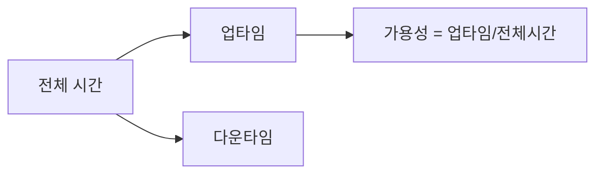
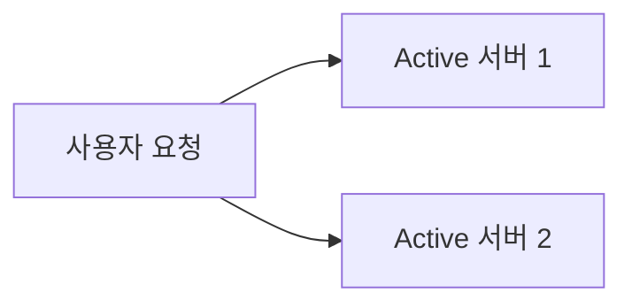
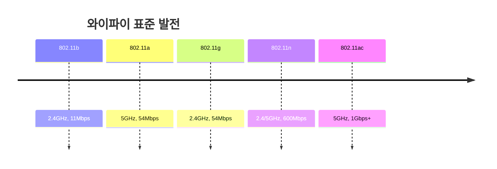

네트워크 안정성은 특정 기능을 언제든 균일한 성능으로 수행할 수 있는 특성을 의미합니다. 기업의 IT 시스템이 중단을 방지, 탐지, 대응 및 신속하게 복구할 수 있는 능력을 포함합니다.

## 07-1 안정성을 위한 기술

### 가용성
가용성은 컴퓨터 시스템이 특정 기능을 실제로 수행할 수 있는 시간의 비율을 의미합니다. 일반적으로 "파이브 나인스"(99.999%)를 목표로 하며, 이는 연간 다운타임이 단 몇 분에 불과함을 의미합니다.

### 이중화
이중화는 시스템의 안정성을 높이기 위한 기본적인 방법으로, 다음과 같은 방식이 있습니다.
무언가를 이중으로 두는 기술입니다. (백업 만들기)

**Active-Standby 구성** (FailOver)
- 성능상의 큰 변화를 기대하긴 힘듬 (한번에 하나만 구동)

**Active-Active 구성**
- 부하를 분산시킬 수 있고, 성능상의 이점이 있음. 

### 로드 밸런싱
여러 대의 서버에 트래픽을 분산시켜 서버의 부하를 분산하는 기술입니다.
![[Pasted image 20250108174213.png]]
#### 로드밸런싱 알고리즘 유형

##### 라운드 로빈 알고리즘
클라이언트의 요청을 순차적으로 각 서버에 균등하게 분배하는 방식입니다. 예를 들어 서버 A, B, C가 있다면 A → B → C → A 순서로 요청이 할당됩니다. 서버들이 동일한 스펙을 가지고 있고 연결이 오래 지속되지 않는 경우에 적합합니다.

##### 가중치 라운드 로빈 알고리즘
각 서버에 가중치를 부여하여 성능이 좋은 서버에 더 많은 요청을 할당하는 방식입니다. 예를 들어 서버 A의 가중치가 8, B가 2, C가 3이라면 서버 A에 8개, B에 2개, C에 3개의 요청이 할당됩니다. 서버 간 성능 차이가 있을 때 효과적입니다.

##### 최소 연결 알고리즘
현재 연결 수가 가장 적은 서버에 새로운 요청을 할당하는 방식입니다. 각 서버의 실시간 부하 상태를 반영하여 분배하므로, 요청 처리 시간이 달라지는 동적인 환경에서 효과적입니다.

##### 가중치 최소 연결 알고리즘
최소 연결 방식에 서버별 가중치를 추가한 알고리즘입니다. 서버의 처리 능력에 따라 다른 가중치를 부여하고, 현재 연결 수와 가중치를 모두 고려하여 요청을 분배합니다. 서버들의 처리 능력이 다르고 요청 처리 시간이 가변적일 때 가장 효과적입니다.

#### 알고리즘 선택 기준

| 상황               | 권장 알고리즘    |
| ---------------- | ---------- |
| 동일 서버 스펙, 짧은 연결  | 라운드 로빈     |
| 서버 성능 차이 존재      | 가중치 라운드 로빈 |
| 요청 처리 시간 불규칙     | 최소 연결      |
| 성능 차이 + 가변적 처리시간 | 가중치 최소 연결  |

| 구분    | L4 로드밸런서 | L7 로드밸런서 |
| ----- | -------- | -------- |
| 분산 기준 | IP/Port  | URL/컨텐츠  |
| 처리 속도 | 빠름       | 상대적으로 느림 |
| 보안성   | 기본적      | 높음       |

## 07-2 안전성을 위한 기술

### 프록시 서버 구성
프록시는 '대리'라는 의미로, 클라이언트와 서버 사이에서 중계 역할을 수행하는 시스템입니다. 클라이언트가 직접 서버와 통신하는 대신, 프록시 서버가 요청을 대신 처리하고 결과를 전달합니다

**Forward Proxy**
- 클라이언트 측에 위치
- 내부 네트워크 사용자의 외부 접근을 제어
- 주요 용도:
    - 웹 사용 제한
    - 캐싱
    - 클라이언트 익명성 보장

**Reverse Proxy**
- 서버 측에 위치
- 외부에서 내부 서버로의 접근을 제어
- 주요 용도:
    - 로드 밸런싱
    - SSL 종료
    - 내부 서버 보호

### 암호화 방식
**대칭키 암호화**

**공개키 암호화**

### HTTPS : SSL과TLS
HTTPS는 HTTP에 보안 계층을 추가한 프로토콜로, SSL(Secure Socket Layer)/TLS(Transport Layer Security)를 통해 데이터를 암호화하여 안전한 통신을 제공합니다.

## ClientHello

- 클라이언트가 서버에 연결을 시도
- 지원하는 TLS 버전, 암호화 방식, 임의의 클라이언트 난수값 전송

## 2. ServerHello

- 서버가 클라이언트의 요청에 응답
- 사용할 암호화 방식 선택 및 서버 인증서 전송
- 서버 난수값 생성하여 전송

## 3. 인증 및 키 교환

- 클라이언트가 서버의 인증서 검증
- 프리마스터 시크릿(premaster secret) 생성 및 전송
- 서버의 공개키로 암호화하여 전송

## 4. 세션 키 생성

- 클라이언트 난수, 서버 난수, 프리마스터 시크릿을 조합하여 세션 키 생성
- 양측에서 동일한 세션 키 생성

## 5. 완료

- 클라이언트와 서버가 각각 "Finished" 메시지 전송
- 생성된 세션 키로 암호화된 통신 시작
![[Pasted image 20250108175911.png]]

## 07-3 무선 네트워크

### 와이파이 표준 발전

