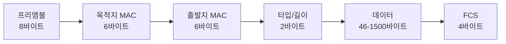
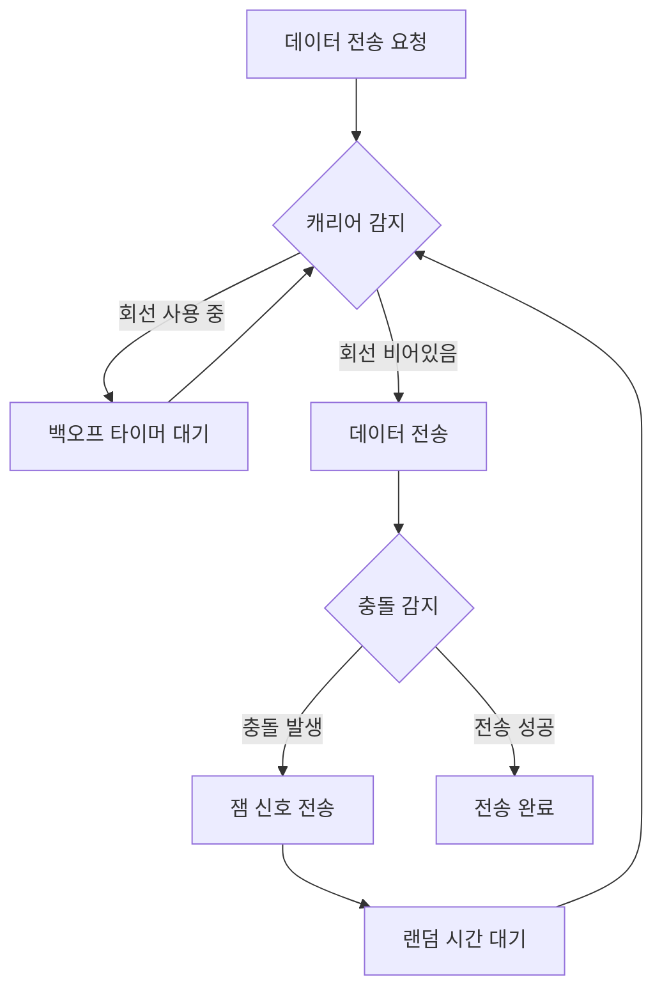
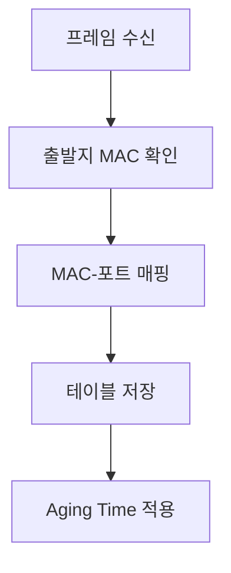
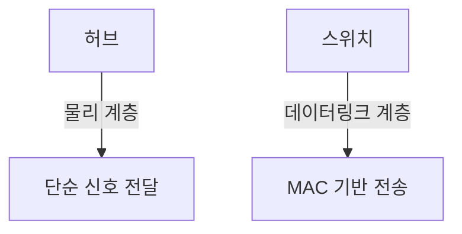

## 1장 간단 요약
![[Pasted image 20241112124902.png]]

1. 네트워크 기본 구조
	- 노드 - 노드
	- 연결은 간선 - 유무선 통신 매체
	- 중간 노드는 네트워크 장비

2. 메시지 교환 방식
	1. 회선 교환 -> 전화기
	2. 패킷 교환 -> 막 보내고 수신 측에서 재조립

3. 주소
	1. 유니캐스트  -> 1 : 1
	2. 애니캐스트 -> 1 : 1 (가장 가까운 회선에 전송)
	3. 브로드캐스트 -> 1 : N
	4. 멀티캐스트 -> 1 : N  (그룹짓기)

4. OSI 7 Layer
	- 각 계층에서 송수신 되는 메시지는 PDU (Protocol Data Unit)
	![[Pasted image 20241112125521.png]]

5. 네트워크 성능 지표
	1. 처리율
		단위 시간당 네트워크를 통해 실제로 전송되는 정보량
	2. 대역폭
		단위 시간 동안 통신 매체를 통해 송수신할 수 있는 최대 정보량
	3. 패킷 손실
		송수신되는 패킷이 손실된 상황

# 제2장 이더넷과 네트워크 장비의 이해

## 2.1 이더넷(Ethernet)
![[Pasted image 20241112131112.png]]

### 기본 개념
- 가장 보편적인 LAN(Local Area Network) 기술
- IEEE 802.3 표준 기반
- 데이터 전송을 위한 케이블링 규격 정의

### 이더넷 표준 명명법
> [!info] 표기 형식: `속도BASE-매체유형`
> 예시: 100BASE-TX
> - 100: 통신 속도(Mbps)
> - BASE: 베이스밴드 방식
> - TX: 통신 매체 종류

| 표준 | 속도 | 케이블 종류 | 최대 거리 |
|:---:|:---:|:---:|:---:|
| 10BASE-T | 10Mbps | Cat 3 | 100m |
| 100BASE-TX | 100Mbps | Cat 5 | 100m |
| 1000BASE-T | 1Gbps | Cat 5e/6 | 100m |
| 10GBASE-T | 10Gbps | Cat 6a/7 | 100m |

### 이더넷 프레임 구조

> [!note] 주요 타입 값
> - 0x0800: IPv4
> - 0x0806: ARP
> - 0x86DD: IPv6

## 2.2 NIC와 케이블링

### NIC (Network Interface Card)
호스트와 통신 매체 사이의 인터페이스 역할을 담당하는 네트워크 장비

> [!tip] NIC의 핵심 기능
> 1. 물리적 네트워크 연결
> 2. 고유 MAC 주소 보유
> 3. 데이터 송수신
> 4. 프레임 처리

### 네트워크 케이블
#### 트위스티드 페어 케이블
- [[UTP vs STP|케이블 비교]]
	- UTP (Unshielded)
		- 일반적
		- 경제적
		- 설치 용이
	- STP (Shielded)
		- 노이즈 차단 우수
		- 고비용
		- 설치 복잡

#### 광섬유 케이블
1. 싱글모드
	- 코어: 8~10μm
	- 장거리 통신용
	- 고비용
2. 멀티모드
	- 코어: 50/62.5μm
	- 중거리 통신용
	- 상대적 저가

## 2.3 허브(Hub)
> [!warning] 허브의 제한사항
> - 물리 계층 장비
> - 단순 신호 증폭
> - 모든 포트로 데이터 전송
> - 하나의 콜리전 도메인 형성

# CSMA/CD (Carrier Sense Multiple Access with Collision Detection)

## 기본 개념
> [!info] CSMA/CD는 이더넷에서 사용되는 매체 접근 제어(MAC) 방식입니다. 여러 장치가 하나의 통신 회선을 공유할 때 충돌을 제어하는 방법을 정의합니다.

## 동작 과정

### 1. Carrier Sense (캐리어 감지)
- 전송 전 회선 상태 확인
- 다른 장치의 전송 여부 감지
- 신호가 감지되면 전송 연기

### 2. Multiple Access (다중 접근)
- 여러 장치가 동시에 회선 공유
- 모든 장치가 동등한 전송 권한
- 회선이 비어있을 때 전송 시도

### 3. Collision Detection (충돌 감지)
> [!warning] 충돌 발생 시 처리 과정
> 1. 충돌 감지 즉시 잼(jam) 신호 전송
> 2. 모든 장치에 충돌 사실 알림
> 3. 백오프(backoff) 알고리즘 실행
> 4. 랜덤 시간 대기 후 재전송

### 4. 백오프 알고리즘
- 충돌 횟수에 따라 대기 시간 증가
- 최대 16회까지 재시도
- 이후 전송 포기하고 상위 계층에 오류 보고

## 장단점

### 장점
- 구현이 단순
- 적은 트래픽에서 효율적
- 특별한 제어 장치 불필요

### 단점
- 트래픽 증가 시 성능 저하
- 충돌로 인한 대역폭 낭비
- 실시간 통신에 부적합

> [!tip] 현대 네트워크에서의 CSMA/CD
> 스위치 기반 네트워크의 등장으로 충돌 도메인이 분리되어 CSMA/CD의 중요성은 감소했지만, 여전히 이더넷의 기본 동작 원리로서 중요한 의미를 가집니다.

---

## 2.4 스위치(Switch)

### 주요 특징
> [!success] 스위치의 장점
> - 데이터 링크 계층 동작
> - MAC 주소 기반 스위칭
> - 포트별 충돌 도메인 분리
> - 효율적인 데이터 전송

### MAC 주소 학습

### VLAN 구성
1. 포트 기반
	- 물리적 포트별 할당
	- 간단한 구성
	- 제한된 유연성

2. MAC 기반
	- MAC 주소별 할당
	- 위치 독립적
	- 복잡한 관리

---

# 제2장 요약: 이더넷과 네트워크 장비

> [!summary] 핵심 내용
> 1. 이더넷은 가장 보편적인 LAN 기술로, IEEE 802.3 표준을 따름
> 2. 네트워크 장비는 계층별로 다른 특성과 기능을 가짐
> 3. 케이블 종류와 특성에 따라 네트워크 성능이 결정됨

## 주요 개념 정리

### 1. 이더넷 기술
- 표준 명명법: `속도BASE-매체유형`
- 프레임 구조: 프리앰블 → MAC 주소 → 타입/길이 → 데이터 → FCS

### 2. 네트워크 케이블
- **트위스티드 페어**
  - UTP: 일반적, 경제적
  - STP: 노이즈 차단, 고비용
- **광섬유**
  - 싱글모드: 장거리
  - 멀티모드: 중거리

### 3. 네트워크 장비

### 4. CSMA/CD
- 충돌 감지 및 제어 메커니즘
- 현대 네트워크에서는 스위치 사용으로 중요성 감소

### 5. 핵심 차이점
| 구분 | 허브 | 스위치 |
|:---:|:---|:---|
| 계층 | 물리 계층 | 데이터링크 계층 |
| 전송방식 | 모든 포트로 전송 | MAC 기반 선택 전송 |
| 충돌 도메인 | 하나의 도메인 | 포트별 분리 |
