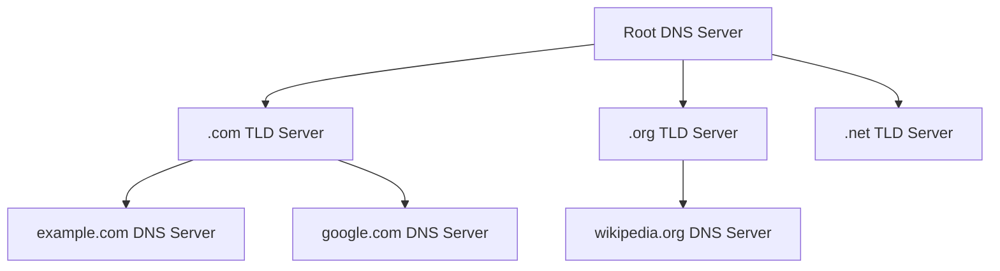
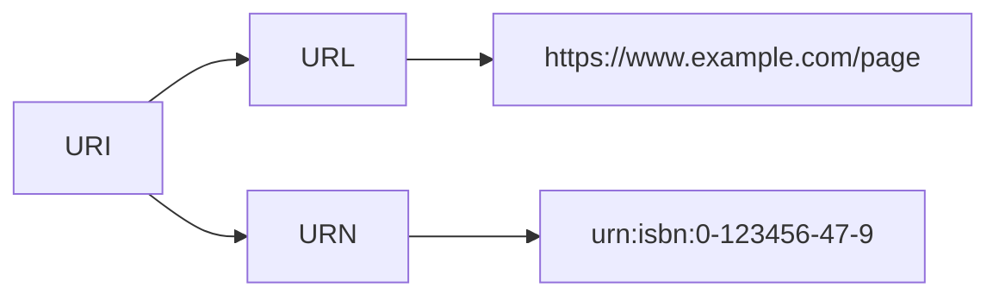
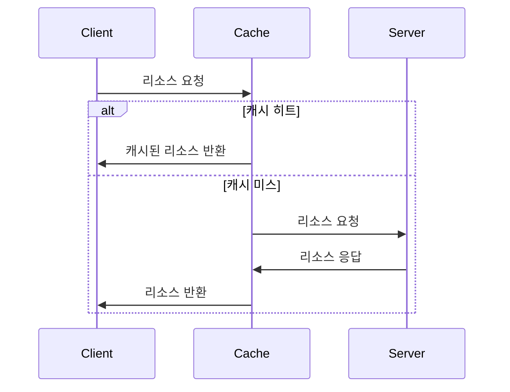

# 응용 계층: DNS와 HTTP

## 05-1 DNS와 자원

### 도메인 네임과 네임 서버

도메인 네임 시스템(DNS)은 인터넷의 전화번호부
IP 주소를 사람이 기억하기 쉬운 도메인 이름으로 변환해주는 시스템

### DNS 네임서버의 유형

DNS 시스템에는 4가지 주요 네임서버가 있습니다:

| 네임서버 유형                  | 역할           | 특징                                                      |
| ------------------------ | ------------ | ------------------------------------------------------- |
| Root DNS Server          | 최상위 DNS 서버   | • 전세계 13개 루트 서버 그룹 존재<br>• TLD DNS 서버 정보 제공             |
| TLD DNS Server           | 최상위 도메인 관리   | • .com, .net, .kr 등 도메인 관리<br>• 해당 도메인의 권한 DNS 서버 정보 제공 |
| Authoritative DNS Server | 실제 도메인 IP 관리 | • 도메인-IP 매핑 정보 저장<br>• 최종 IP 주소 정보 제공                   |
| Local DNS Server         | DNS 캐시 및 리졸빙 | • ISP에서 제공<br>• DNS 쿼리 대행 및 캐시 기능                       |

### DNS 리졸빙 과정

클라이언트 -> Local DNS -> Root DNS -> Local DNS -> TLD DNS -> 
Local DNS -> Auth DNS -> Local DNS -> 클라이언트

[클라이언트] --- (1) www.example.com 요청 --> [Local DNS]
   [Local DNS] --- (2) 루트 쿼리 --> [Root DNS]
   [Root DNS] --- (3) TLD 정보 --> [Local DNS]
   [Local DNS] --- (4) TLD 쿼리 --> [TLD DNS]
   [TLD DNS] --- (5) 권한 DNS 정보 --> [Local DNS]
   [Local DNS] --- (6) 권한 쿼리 --> [Auth DNS]
   [Auth DNS] --- (7) IP 주소 --> [Local DNS]
[Local DNS] --- (8) IP 주소 --> [클라이언트]

단계별 처리:

1. 클라이언트 -> Local DNS: "[www.example.com의](http://www.example.com%EC%9D%98) IP는?"
2. Local DNS -> Root: ".com 서버 어디있나요?"
3. Root -> Local: ".com TLD 서버 주소입니다"
4. Local -> TLD: "example.com 서버 어디있나요?"
5. TLD -> Local: "example.com 권한 서버 주소입니다"
6. Local -> 권한: "[www.example.com의](http://www.example.com%EC%9D%98) IP는?"
7. 권한 -> Local: "IP 주소는 93.184.216.34입니다"
8. Local -> 클라이언트: "IP 주소는 93.184.216.34입니다"

리졸빙 과정 설명:

1. 클라이언트가 Local DNS 서버에 도메인 질의
2. Local DNS가 Root DNS 서버에 쿼리
3. Root DNS가 해당 도메인의 TLD DNS 서버 정보 응답
4. Local DNS가 TLD DNS 서버에 쿼리
5. TLD DNS가 해당 도메인의 권한 DNS 서버 정보 응답
6. Local DNS가 권한 DNS 서버에 쿼리
7. 권한 DNS 서버가 최종 IP 주소 응답
8. Local DNS가 클라이언트에게 IP 주소 전달

#### 계층적 네임 서버 구조



1. **루트 DNS 서버**: 최상위 계층 서버
2. **TLD 서버**: .com, .net, .org 등 최상위 도메인 관리
3. **권한 DNS 서버**: 특정 도메인의 DNS 레코드 관리

## URI (Uniform Resource Identifier)


#### URL (Uniform Resource Locator) vs URN (Uniform Resource Name)

| 구성요소  | 설명               | 필수여부 | 예시                                        |
| ----- | ---------------- | ---- | ----------------------------------------- |
| 스키마   | 사용할 프로토콜         | 필수   | https://, http://, ftp://                 |
| 호스트   | 서버의 도메인 이름 또는 IP | 필수   | [www.example.com](http://www.example.com) |
| 포트    | 서버의 포트 번호        | 선택   | :443, :80                                 |
| 경로    | 리소스 경로           | 선택   | /path/page                                |
| 쿼리    | 추가 매개변수          | 선택   | ?name=value&type=new                      |
| 프래그먼트 | 문서 내 특정 부분 지정    | 선택   | #section                                  |



- **URL**: 리소스의 위치를 지정
- **URN**: 리소스의 유니크한 이름을 지정

#### DNS 레코드 타입 

| 레코드 타입 | 설명               | 예시                                               |
| ------ | ---------------- | ------------------------------------------------ |
| A      | 도메인 → IPv4 주소 매핑 | example.com → 93.184.216.34                      |
| AAAA   | 도메인 → IPv6 주소 매핑 | example.com → 2606:2800:220:1:248:1893:25c8:1946 |
| CNAME  | 별칭 레코드           | www.example.com → example.com                    |
| MX     | 메일 서버 지정         | example.com → mail.example.com                   |
| NS     | 네임 서버 지정         | example.com → ns1.example.com                    |
| PTR    | IP 주소 → 도메인 매핑   | 93.184.216.34 → example.com                      |
| SOA    | 도메인의 권한 정보       | 시리얼 번호, 갱신 주기 등                                  |


## 05-2 HTTP

### HTTP의 주요 특성

1. **요청-응답 기반 프로토콜**
   - 클라이언트가 요청을 보내면 서버가 응답
   - 단방향 통신 방식

2. **미디어 독립적 프로토콜**
   - 모든 종류의 데이터 전송 가능
   - Content-Type 헤더로 데이터 타입 지정

3. **스테이트리스 프로토콜**
   - 각 요청은 독립적
   - 이전 요청의 상태를 저장하지 않음

4. **지속 연결 프로토콜**
   - Keep-Alive로 연결 유지
   - 여러 요청/응답에 하나의 연결 재사용

### HTTP 메시지 구조

```
요청 메시지:
POST /submit HTTP/1.1
Host: example.com
Content-Type: application/json

{"name": "John"}

응답 메시지:
HTTP/1.1 200 OK
Content-Type: application/json
Content-Length: 25

{"status": "success"}
```

### HTTP 메서드

| 메서드    | 설명        | 특징         |
| ------ | --------- | ---------- |
| GET    | 리소스 조회    | 캐시 가능, 멱등성 |
| HEAD   | 헤더만 조회    | 응답 본문 제외   |
| POST   | 리소스 생성    | 멱등성 없음     |
| PUT    | 리소스 수정/생성 | 멱등성 있음     |
| PATCH  | 리소스 부분 수정 | 멱등성 없음     |
| DELETE | 리소스 삭제    | 멱등성 있음     |
멱등성 : **동일한 연산을 여러 번 수행해도 결과가 달라지지 않는 성질**
### HTTP 상태 코드

- **2xx (성공)**
  - 200: OK
  - 201: Created
  - 204: No Content

- **3xx (리다이렉션)**
  - 301: Moved Permanently (영구적 리다이렉션 : 재요청 메서드 변경o)
  - 302: Found (영구적 리다이렉션 : 재요청 메서드 변경o)
  - 303 : See other (영구적 리다이렉션 : 재요청 메서드 GET으로 변경)
  - 304: Not Modified
  - 307 : Temporary Redirect (영구적 리다이렉션 : 재요청 메서드 변경x)
  - 308: Permanent Redirect (영구적 리다이렉션 : 재요청 메서드 변경x)

- **4xx (클라이언트 에러)**
  - 400: Bad Request
  - 401: Unauthorized
  - 404: Not Found

- **5xx (서버 에러)**
  - 500: Internal Server Error
  - 502: Bad Gateway
  - 503: Service Unavailable

## 05-3 HTTP 헤더와 HTTP 기반 기술

### 주요 HTTP 헤더

#### 요청 헤더
- User-Agent: 클라이언트 정보
- Accept: 선호하는 미디어 타입
- Authorization: 인증 정보

#### 응답 헤더
- Server: 서버 정보
- Location: 리다이렉션 URL
- Content-Type: 응답 본문 타입

#### 공통 헤더
- Cache-Control: 캐시 동작 방식
- Content-Length: 본문 길이
- Connection: 연결 관리

### 캐시



### 쿠키

- 서버가 클라이언트에 상태 정보를 저장
- Set-Cookie 헤더로 생성
- Cookie 헤더로 전송
- Secure 속성 : https가 사용될 때만 쿠키 전송
- HttpOnly 속성 : http 송수신을 통해서만 쿠키 이용하도록 설정 (자바스크립트로 스니핑 방지)