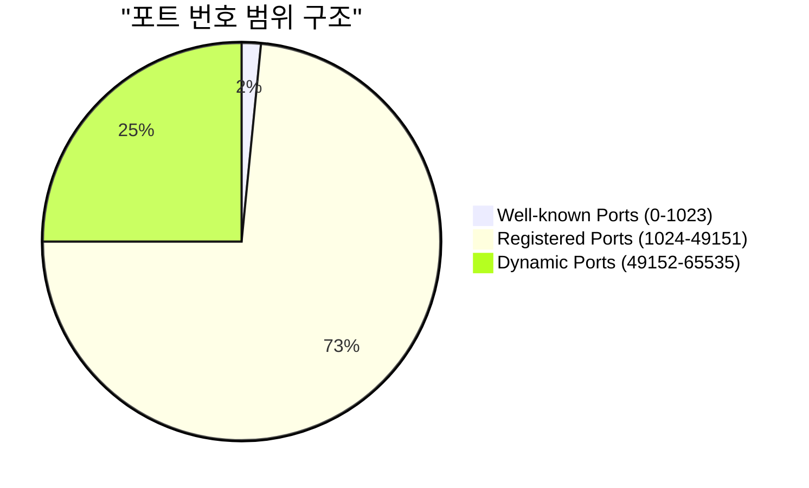
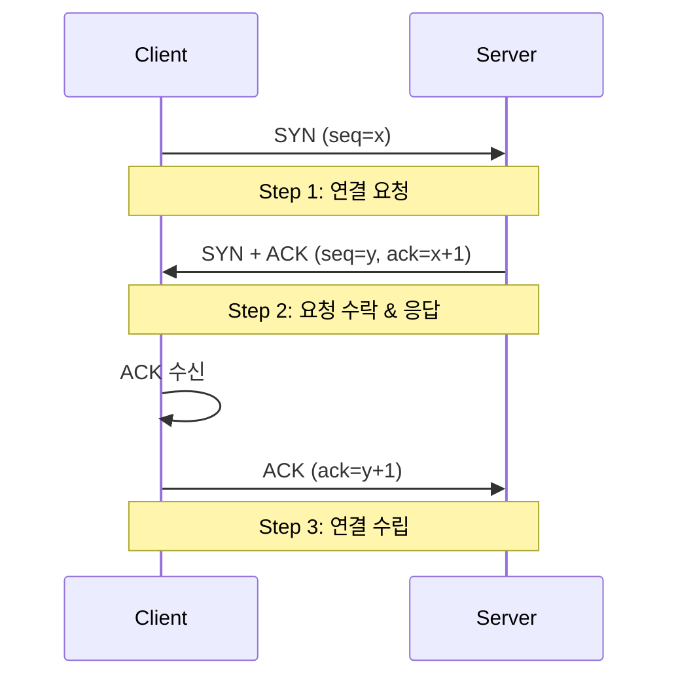
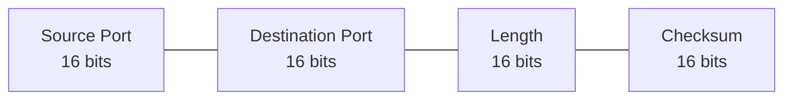

# 4장. 전송 계층 (Transport Layer)

## IP의 한계와 전송 계층의 필요

### IP의 주요 한계점
- **신뢰성 부족**
	- 패킷 손실 발생 가능
	- 순서 보장되지 않음
	- 중복 전송 가능성 존재
- **비연결성**
	- 사전 연결 설정 없음
	- 수신자 상태 확인 불가
	- 일방적 데이터 전송

### 전송 계층의 역할
- **신뢰성 보장**
	- 패킷 손실 감지 및 복구
	- 순서 보장
	- 중복 제거
- **연결성 제공**
	- 양방향 통신
	- 상태 추적
	- 흐름/혼잡 제어

## 포트와 다중화

### 포트 번호 구조 (0~ 65536)

### 주요 포트 번호
- **Well-known Ports (0-1023)**
	- HTTP: 80
	- HTTPS: 443
	- FTP: 20, 21
	- SSH: 22
	- SMTP: 25
	- DNS: 53
- **Registered Ports (1024-49151)**
	- MySQL: 3306
	- PostgreSQL: 5432
	- Redis: 6379

## TCP (Transmission Control Protocol)

### TCP 3-Way Handshake

### TCP Sliding Window
![[Pasted image 20241209232158.png]]

## TCP 제어 메커니즘

### 오류 제어
- **ARQ 기법**
	1. Stop-and-Wait ARQ
		- 패킷별 확인
		- 타임아웃 기반 재전송
	2. Go-Back-N ARQ
		- 윈도우 기반 전송
		- 누적 확인 응답
	3. Selective Repeat ARQ
		- 선택적 재전송
		- 개별 확인 응답

### 흐름 제어
- **슬라이딩 윈도우**
	- 동적 윈도우 크기
	- 수신 버퍼 관리
	- 오버플로우 방지
- **제어 방식**
	- 수신 윈도우 광고
	- 전송률 조절
	- Zero 윈도우 처리

### 혼잡 제어
- **알고리즘**
	1. Slow Start
		- 지수적 증가
		- ssthresh 도달까지
	2. Congestion Avoidance
		- 선형적 증가
		- 손실 감지시 감소
	3. Fast Recovery
		- 빠른 복구
		- 중복 ACK 처리

네, TCP 다음에 UDP 섹션을 추가해드리겠습니다.

## UDP (User Datagram Protocol)
### UDP 특징
- **비연결성**
    - 연결 설정/해제 없음
    - 상태 관리 불필요
    - 낮은 프로토콜 오버헤드
- **신뢰성 없음**
    - 패킷 손실 가능
    - 순서 보장 없음
    - 중복 검사 없음
- **단순성과 효율성**
    - 최소한의 헤더
    - 빠른 전송 속도
    - 실시간 응용에 적합

### UDP 헤더 구조

### UDP 활용 사례
- **실시간 스트리밍**
    - 화상 회의
    - 실시간 게임
    - 음성 통화
- **DNS 서비스**
    - 도메인 조회
    - 빠른 응답 필요
- **DHCP**
    - IP 주소 할당
    - 네트워크 구성

### TCP vs UDP 비교
| 특성    | TCP           | UDP           |
| ----- | ------------- | ------------- |
| 연결 방식 | 연결형           | 비연결형          |
| 신뢰성   | 높음            | 낮음            |
| 속도    | 상대적 느림        | 빠름            |
| 순서 보장 | 있음            | 없음            |
| 혼잡 제어 | 있음            | 없음            |
| 활용 예  | 웹, 이메일, 파일 전송 | 스트리밍, DNS, 게임 |

### 1. 슬로 스타트

- TCP 연결이 시작될 떄, cnwd의 값은 일반적으로 1MSS로 초기화된다.
- **확인응답을 받을 때마다 cnwd의 크기를 1MSS 씩 증가**시킨다.
    - 확인응답 당 1MSS 증가이므로 1개의 세그먼트 전송 → 1개의 응답(cnwd+1) → 2개의 세그먼트 전송 → 2개의 응답(cnwd+2) → 4개의 세그먼트 전송 → …
    - 결국 확인응답(ACK)마다 cnwd의 크기를 1씩 증가시키면 **매 RTT 마다 cnwd의 크기가 지수적으로 증가하는 효과를 얻게 된다.**
- 혼잡 윈도우의 지수적 증가는 영원할 수 없다. 

1. **만약 타임아웃에 의한 손실이 일어난 경우,** TCP에서는 슬로 스타트의 임계치인 ssthresh의 값을 cwnd/2 으로 정하고 cwnd의 값을 1로 한 뒤 TCP는 새로운 **슬로 스타트**를 시작한다. 
2. **cnwd의 값이 sshtresh 값에 도달하게 되면** 슬로 스타트를 종료하고 **혼잡 회피 모드**로 전환한다. 
3. **만약 3개의 중복 ACK들이 검출되면 cnwd의 값을 ssthresh+3MSS로 한 뒤** 빠른 회복 상태**로 들어간다.

### **2. 혼잡 회피**

위의 설명에서처럼 혼잡 회피 모드로 들어가는 경우 cnwd의 값이 ssthresh 값에 도달한 경우이다. 즉, 혼잡을 마지막으로 검출한 시점의 cnwd 값의 절반인 범위에서 다시 cnwd의 값을 2배로 증가시키는 것은 좋은 선택이 아닐 것이다. 혼잡 회피 모드에서는 더 보수적인 방법을 선택한다. 

- **확인응답을 받을 때마다 cnwd의 크기를 1 MSS/cwnd만큼 증가**시킨다.  
    - 만약 현재 혼잡 윈도우의 크기가 10 MSS 이라면, 10개의 세그먼트를 보낼 것이고, 각 세그먼트의 ACK당 cnwd의 크기는 1/10 MSS 만큼 커진다. 결국 모든 ACK를 성공적으로 받게 되면 cnwd의 크기는 1 MSS만큼 커지는 것이다
    - 다시 말하자면, **매 RTT 마다 cnwd의 크기는 1 증가한다.**
- 혼잡 회피 모드 또한 영원히 지속되지 않는다.

1. **타임아웃이 발생한다면** ssthresh의 값을 cwnd/2으로 정하고 cwnd의 값을 1로 한 뒤 **슬로 스타트 단계로 들어간다.**
2. **만약 3개의 중복 ACK들이 검출되면** ssthresh 값을 cnwd/2으로 정하고 cnwd의 값을 ssthresh+3MSS로 한다. 이후 **빠른 회복 상태로 들어간다.**

### **3. 빠른 회복 TCP Reno / TCP Tahoe**

빠른 회복은 필수적인 TCP 요소는 아니다. TCP Reno라고 불리는 새로운 버전에서 채택한 방식이다. 초기 TCP 버전인 TCP Tahoe에서는 빠른 회복 없이 무조건 혼잡 윈도우를 1MSS로 줄이는 슬로 스타트 단계로 들어간다.

빠른 회복에서는 조금 다른 방식으로 혼잡 윈도우의 크기를 조절한다. 빠른 회복에 들어갈 때, 혼잡 윈도우의 크기를 반으로 한다는 설명은 많으나 그 이후의 과정은 자세하게 찾을 수 없었다. 게다가 빠른 회복으로 들어갈 때, 혼잡 윈도우의 크기를 절반으로 줄이고 +3MSS의 값을 더해주는 것이 정확한 설명이다. 

- 손실된 세그먼트에 대한 **중복된 ACK를 수신할 때마다 cnwd의 크기를 1 MSS 증가시킨다.**
    - "손실된 세그먼트에 대한 매 중복된 ACK를 수신할 때마다 1 MSS 씩 증가시킨다" 라는 의미를 이해하는 것이 중요하다.
    - 빠른 회복 단계에는 중복된 ACK가 3개 검출되면 들어오게 된다. 즉 정상적으로 도착했으나 순서가 맞지 않은 세그먼트가 3개 존재한다. 이 때 송신측에서는 혼잡 윈도우의 크기를 3개 늘려주어야 제대로 된 패킷을 재전송할 수 있다. 그렇기 때문에 빠른 회복 모드로 들어갈 때 +3 MSS를 해주는 것이다.
    - 같은 이유로 중복된 ACK가 발생하면 손실된 세그먼트를 전송해주기 위해서는 윈도우의 크기가 여유로워야 하기 때문에 혼잡 윈도우의 크기에 +1MSS를 반복하는 것이다.
- 즉, 빠른 회복은 말 그대로 손실로 부터 **회복하기 위해 잠깐 거쳐 가는 단계**라고 생각할 수 있다. 

1. **새로운 ACK를 받으면** cnwd의 값을 sshtresh 값으로 정하고 **혼잡 회피 모드로 들어간다.**
2. **타임아웃이 발생한다면** ssthresh의 값을 cwnd/2으로 정하고 cwnd의 값을 1로 한 뒤 **슬로 스타트 단계로 들어간다.**

![[Pasted image 20241216233106.png]]

1. 기본 용어

- TCP (Transmission Control Protocol) : 인터넷에서 데이터를 신뢰성 있게 전송하기 위한 프로토콜
- RTT (Round Trip Time) : 데이터가 송신자로부터 수신자까지 갔다가 다시 돌아오는데 걸리는 시간
- ACK (Acknowledgment) : 수신자가 데이터를 잘 받았다는 것을 알리는 확인 응답

2. 윈도우 관련 용어

- cwnd (Congestion Window) : 송신자가 ACK를 받지 않고도 한 번에 보낼 수 있는 데이터의 양
- rwnd (Receiver Window) : 수신자가 받을 수 있는 데이터의 양
- awnd (Advertisement Window) : 실제로 사용할 수 있는 윈도우 크기 (cwnd와 rwnd 중 작은 값)

3. 크기 관련 용어

- MSS (Maximum Segment Size) : TCP가 한 번에 전송할 수 있는 최대 세그먼트 크기
- ssthresh (Slow Start Threshold) : 느린시작 임계값으로, 이 값을 넘으면 혼잡 회피 단계로 전환

4. 패킷 손실 관련 용어

- 중복 ACK (Duplicate ACK) : 같은 순서번호의 ACK가 반복해서 도착하는 현상
- 타임아웃 (Timeout) : 일정 시간 동안 ACK가 도착하지 않는 상황

5. 혼잡제어 상태 관련 용어

- 혼잡(Congestion) : 네트워크의 처리 능력보다 많은 데이터가 몰리는 상황
- 플로우 컨트롤(Flow Control) : 수신자의 처리 능력을 고려한 데이터 전송 제어
- 혼잡 윈도우(Congestion Window) : 네트워크의 혼잡도를 고려하여 조절되는 윈도우 크기